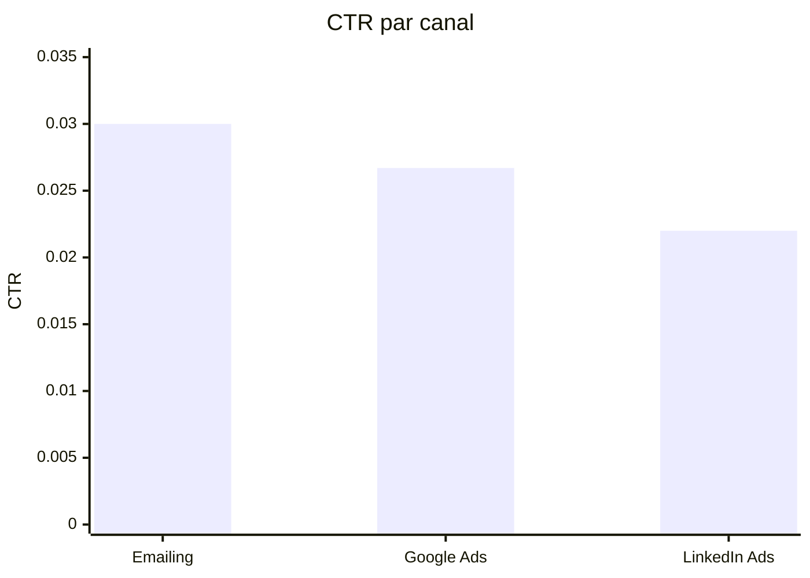
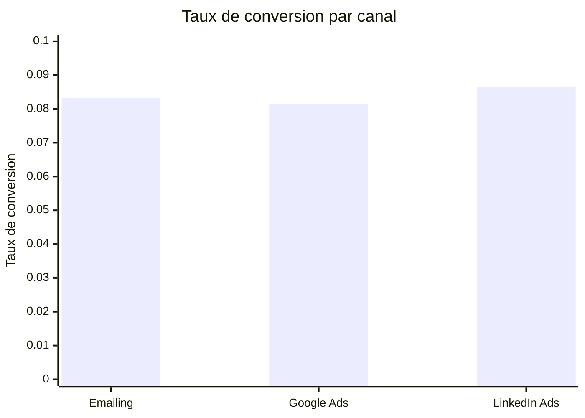
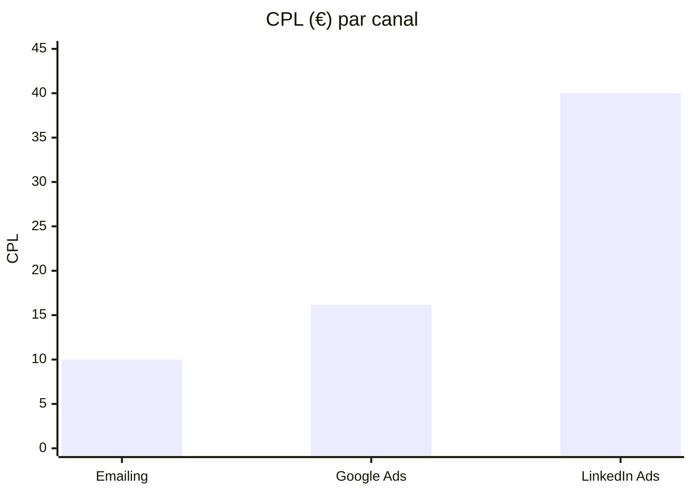
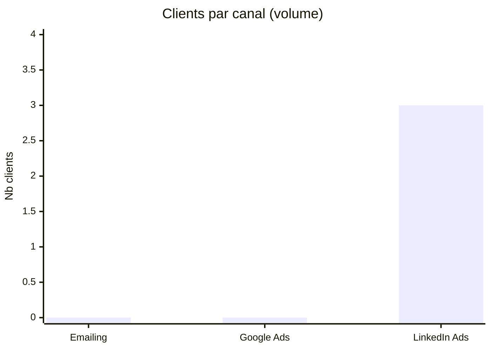
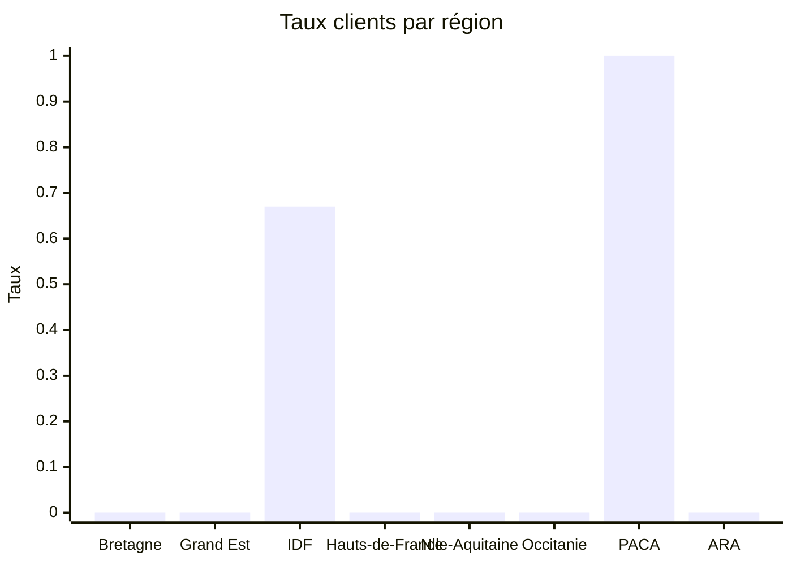

# Tableau de bord décisionnel – NovaRetail (Octobre 2025)

## KPI clés (max 6)

1. **CTR moyen (3 canaux)** : **2,62 %**
2. **Taux de conversion moyen** : **8,37 %**
3. **CPL moyen** : **22,05 €**
4. **Canal au meilleur CTR** : **Emailing (3,00 %)**
5. **Canal au meilleur taux de conversion** : **LinkedIn Ads (8,64 %)**
6. **Canal au CPL le plus faible** : **Emailing (10,00 €)**

---

## Visualisations (5)

### 1) Quel canal génère le meilleur CTR ?

### 2) Quel canal convertit le mieux après clic ?

### 3) Quel canal minimise le coût par conversion (CPL) ?

### 4) Comment se répartissent les statuts CRM par canal ?

### 5) Quelles régions montrent le meilleur taux de clients ?

---

## Lecture rapide pour décideur

- **Emailing** est le meilleur canal en efficacité coût (CPL).
- **LinkedIn Ads** fournit la meilleure conversion et concentre les clients observés.
- **Google Ads** reste intermédiaire, avec un potentiel d’optimisation sur le ciblage et les pages d’atterrissage.
